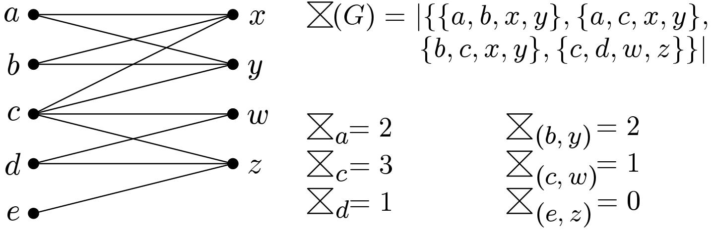

<h1 align="center">Butterfly Counting in Bipartite Networks</h1>

<h2>Paper</h2>
You can find our paper on ArXiv: https://arxiv.org/pdf/1801.00338v4.pdf
<h4>Abstract</h4>
We consider the problem of counting motifs in bipartite affiliation networks, such as author-paper, user-product, and actor-movie relations. We focus on counting the number of occurrences of a "butterfly", a complete 2 x 2 biclique, the simplest cohesive higher-order structure in a bipartite graph. Our main contribution is a suite of randomized algorithms that can quickly approximate the number of butterflies in a graph with a provable guarantee on accuracy. An experimental evaluation on large real-world networks shows that our algorithms return accurate estimates within a few seconds, even for networks with trillions of butterflies and hundreds of millions of edges.
  

  
  <figcaption> 
    There are 4 butterflies in the entire graph G, and the number of per-vertex and per-edge butterflies are shown for some vertices/edges.
    </figcaption>

<h2>Implementation</h2>

__BFC.cpp__ is the source code for an exact algorithm and a suite of randomized algorithms to count the number of butterflies in a bipartite network. This is the implementation for our paper on ArXiv: https://arxiv.org/pdf/1801.00338v4.pdf

___Disclaimer:__ For the sake of simplicity for reviewers and researchers to understand our implementation, this source code is a little bit different than what we ran on the large bipartite networks. For example, in this implementation we __DO NOT__ remove vertices with degree zero, or we use __vectors__ for adjacency lists and __binary_search__ function for edge sampling. However, as mentioned in the paper, we could use __hashsets (unordered_sets)__ instead of __vectors__._
